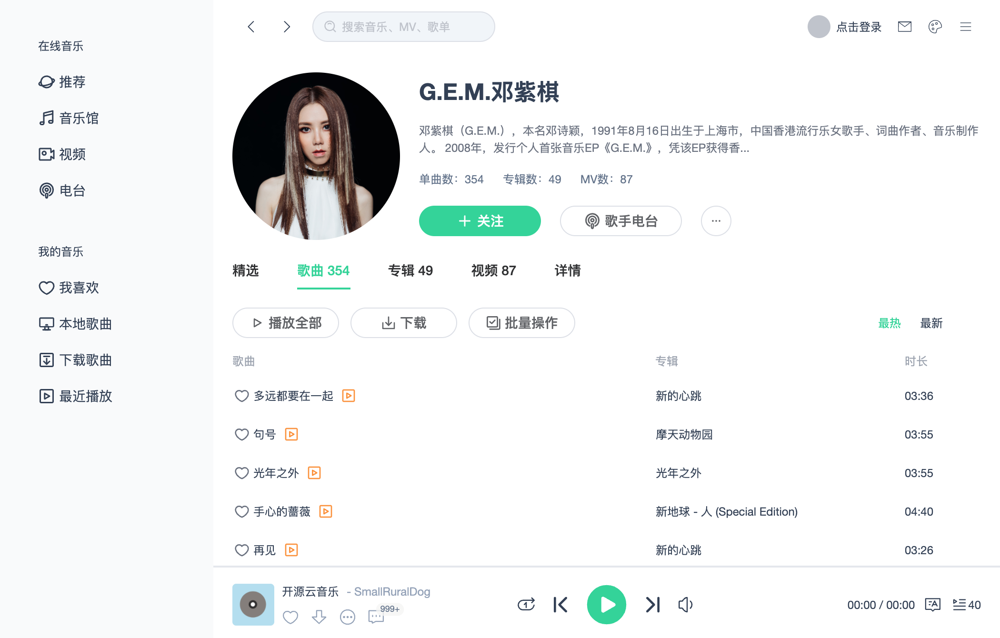
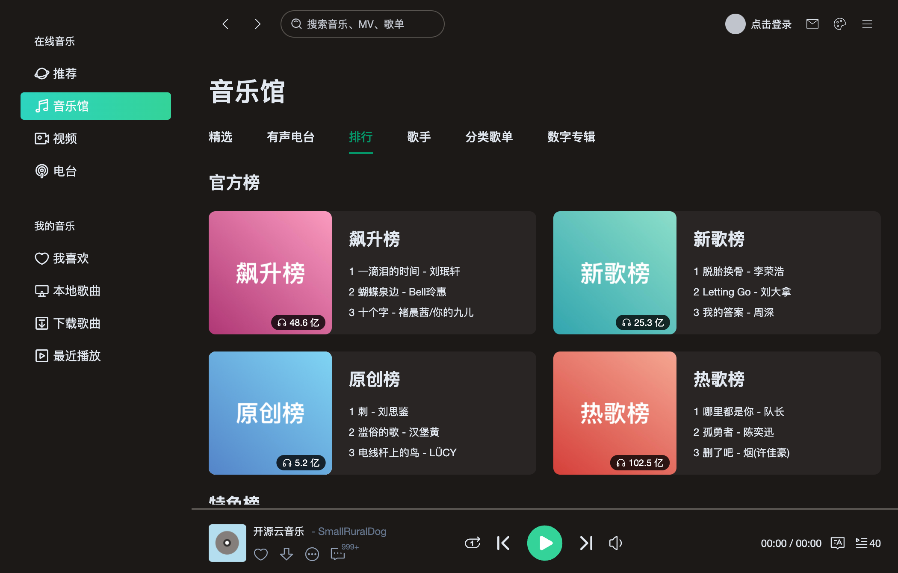

# VUE3-MUSIC

基于 VUE3+TS 开发的音乐播放器，界面模仿QQ音乐mac客户端。

在线体验：[https://smallruraldog.github.io/vue3-music](https://smallruraldog.github.io/vue3-music)

将浏览器大小设置成1050*670，体验效果更好！界面是自适应的，使用[tailwindcss.com](https://www.tailwindcss.com)来实现

手机端未适配，后期会使用[Flutter](https://flutter.dev)单独开发手机客户端，使用[Electron](https://www.electronjs.org)打包桌面客户端并内置API服务

在线演示为了安全考虑，不提供API接口服务，需要准备好自己的API服务地址，并且是HTTPS的，没有HTTPS的服务，可以本地运行，首次打开时会要求设置API地址


## 技术点
* vue3
* vue-router
* typescript
* axios
* [pinia 数据状态管理](https://pinia.vuejs.org/zh/introduction.html)
* vite 打包
* [tailwindcss](https://www.tailwindcss.cn/docs/installation)


## 本地安装

```
git clone https://github.com/SmallRuralDog/vue3-music.git
cd vue3-music
yarn
yarn run dev
```

## 网易云音乐API

需要运行API服务才能正常体验

[开发文档](https://binaryify.github.io/NeteaseCloudMusicApi)

```
npx NeteaseCloudMusicApi

```


## UI







## PS

通过此开源项目学习VUE3的强大..加油！
